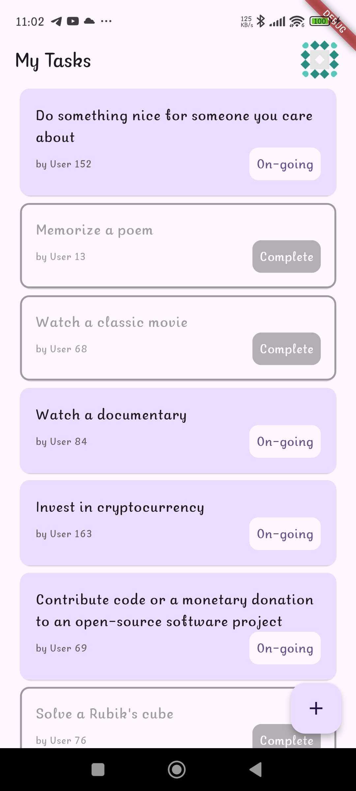

# Task Manager App With Material design Flutter BLoC


## Features
- Login with username and password
- Fetch Tasks App from API
- Use BLoC as state management
- Add new Task
- Change status from On-Going to Completed
- Change the task name
- Delete task
- Display user profile.
- Save user tasks to ensure that tasks remain accessible even when the app is closed and
  reopened.
- Use Material 3 design system

## Libraries & Tools Used
- Flutter BLoC (for State Management).
- Shared Preference (For storage).
- Get It (Service Locator and Dependencies container).
- Dio (Http Client).
- BLoC Test.
- Mockito for testing.

## Folder Structure
Here is the core folder structure which flutter provides.

```
flutter-app/
|- android
|- build
|- ios
|- lib
|- test
```

Here is the folder structure we have been using in this project

```
lib/
|- app/
  |- modules/
    |- app_bloc/
    |- home/
    |- login/
  |- shared/
    |- models/
    |- repos/
    |- http_client/
|- main.dart
```


## Screenshots
| Login page                       | My Tasks                           |
|----------------------------------|------------------------------------|
|        |       |
| ----------------------------     | -------------------------------    |
| Add Task                         | Edit Task status                   |
| ----------------------------     | -------------------------------    |
|     |  |
| ----------------------------     | -------------------------------    |
| Delete Task                      | Profile                            |
| ----------------------------     | -------------------------------    |
|  |        |

